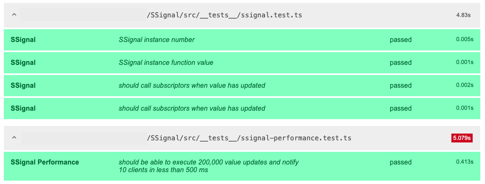

# SSignal

[](https://www.npmjs.com/package/ssignal)
[](LICENSE)

`SSignal` es una clase reactiva que extiende `EventTarget` para la gestión de estados. Proporciona una API simple para suscribirse a cambios de valor en cualquier tipo de dato, incluyendo ahora la capacidad de observar mutaciones en objetos `Map`.

| Propiedad | Tipo | Descripción |
| :-------- | :--- | :---------- |
| `constructor(value: T)` | Método | Crea una nueva instancia de `SSignal`. Puede ser inicializada con cualquier valor, incluyendo objetos `Map`, los cuales serán observados de forma reactiva. |
| `value` | Propiedad (getter/setter) | Propiedad (getter/setter)	Lee o escribe el valor actual del `Signal`. Si el valor es diferente al actual, dispara el evento change. El `setter` también acepta una función de actualización `(prev: T) => T`. |
| `subscribe(callback: (value: T) => void)` | Método | Registra una función `callback` que será llamada cada vez que el valor del `Signal` cambie. Retorna: Una función de desuscripción que, al ser llamada, elimina el listener. |
| `dispatchEvent('change', ...)` | Método | Emite el evento `'change'` a todos los suscriptores. Es invocado automáticamente por el `setter` y por las mutaciones en un `Map` observado. |
| `addEventListener('change', ...)` | Método | Extiende el método nativo de `EventTarget` para agregar un listener al evento `'change'`. |
| `removeEventListener('change', ...)` | Método | Extiende el método nativo de `EventTarget` para eliminar un listener. |

La clase SSignal emite los siguientes eventos:

| Evento | Tipo | Descripción |
| :----- | :--- | :---------- |
| `change` | `CustomEvent<T>` | Disparado cuando el valor de `Signal` cambia. El detalle del evento `(event.detail)` contiene el nuevo valor. |

## Instalación

```sh
npm install ssignal
```

## Características destacadas

*   **API simple**: Con métodos intuitivos como `value`, `subscribe` y `unsubscribe`.
*   **Reactividad**: Emite un evento `'change'` cuando el valor cambia, permitiendo una gestión de estado eficiente.
*   **Soporte nativo para `Map`**: Observa de forma automática las mutaciones en objetos `Map`, disparando eventos sin necesidad de intervención manual.
*   **Seguridad de tipos**: Construido en TypeScript para garantizar la seguridad en todo el proceso.

## Nueva funcionalidad: soporte reactivo para `Map`

Ahora `SSignal` puede manejar de forma reactiva instancias de `Map`. Cuando inicializas `SSignal` con un objeto `Map`, cualquier modificación realizada a través de los métodos nativos `set()`, `delete()` o `clear()` disparará un evento de `change`, notificando a todos los suscriptores.

### Cómo funciona

Al inicializar `SSignal` con una instancia de `Map`, la clase envuelve el objeto en un `Proxy`. Este `Proxy` intercepta las llamadas a los métodos que modifican el `Map` y emite un evento de `change` de forma automática. También se asegura de que los métodos de lectura (`get()`, `has()`, `entries()`, etc.) funcionen correctamente.

### Ejemplo de uso con `Map`

```typescript
// SSignal.ts
import SSignal from './SSignal';

// 1. Crear una instancia de SSignal con un Map
const signalMap = new SSignal(new Map<string, number>());

// 2. Suscribirse a los cambios
const unsubscribe = signalMap.subscribe((value) => {
  console.log('El Map ha cambiado:', value);
  console.log('El tamaño del Map es:', value.size); // Acceder a propiedades como 'size' funciona
});

// 3. Modificar el Map y observar los eventos
signalMap.value.set('a', 1);
// Salida:
// El Map ha cambiado: Map(1) { 'a' => 1 }
// El tamaño del Map es: 1

signalMap.value.set('b', 2);
// Salida:
// El Map ha cambiado: Map(2) { 'a' => 1, 'b' => 2 }
// El tamaño del Map es: 2

signalMap.value.delete('a');
// Salida:
// El Map ha cambiado: Map(1) { 'b' => 2 }
// El tamaño del Map es: 1

// 4. Desuscribirse para dejar de recibir notificaciones
unsubscribe();
```

### Ejemplo de uso con valores primitivos
```typescript
import SSignal from './SSignal';

const signalNumber = new SSignal<number>(0);

signalNumber.subscribe((value) => {
  console.log('El número ha cambiado a:', value);
});

signalNumber.value = 10;
// Salida: El número ha cambiado a: 10

// También soporta la actualización con una función
signalNumber.value = (prev) => prev + 5;
// Salida: El número ha cambiado a: 15

```

## Scripts

- `npm run build`: Compila TypeScript a la carpeta `lib`.
- `npm test`: Ejecuta los tests.
- `npm run test:coverage`: Ejecuta los tests con cobertura.

### Estado de las pruebas de rendimiento



## Licencia

MIT

---

Repositorio: https://github.com/ElJijuna/ssignal