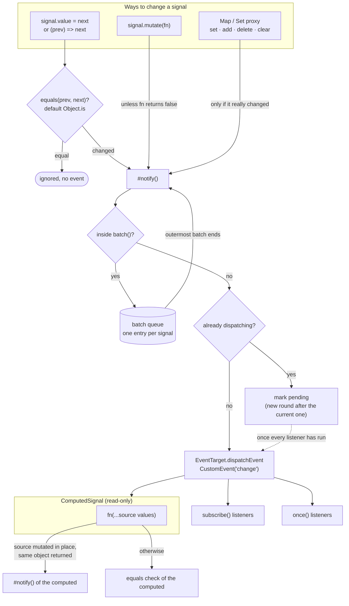
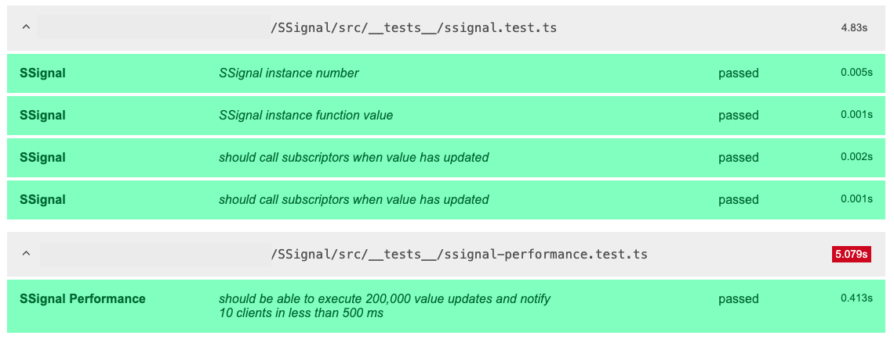

<p align="center">
  
</p>

# SSignal

[](https://www.npmjs.com/package/ssignal)
[](https://www.npmjs.com/package/ssignal)
[](https://github.com/ElJijuna/ssignal/actions/workflows/ci.yml)
[](https://github.com/ElJijuna/ssignal/actions/workflows/release.yml)
[](https://github.com/ElJijuna/ssignal/actions/workflows/web-audit-report.yml)
[](https://bundlephobia.com/package/ssignal)
[](LICENSE)
[](https://nodejs.org)
[](https://www.typescriptlang.org)
[](https://semantic-release.gitbook.io/semantic-release/)
[](https://github.com/ElJijuna/ssignal/stargazers)
[](https://github.com/ElJijuna/ssignal/issues)

A lightweight, zero-dependency reactive signal built on top of the native `EventTarget` API. `SSignal` lets you observe value changes on any data type — including deep mutations on `Map` instances — without a framework, build plugin, or compiler transform.

## Features

- **Simple API** — `value`, `subscribe`, and an unsubscribe function. That's it.
- **Framework-agnostic** — works in the browser, Node.js ≥ 18.7, and any runtime that supports `EventTarget`.
- **Reactive `Map` support** — mutations via `set()`, `delete()`, and `clear()` automatically dispatch change events.
- **Updater functions** — `signal.value = (prev) => prev + 1` for safe derived updates.
- **In-place mutations** — `signal.mutate((list) => list.push(item))` for arrays and objects, with a single change event.
- **Immediate mode** — `{ immediate: true }` fires the callback with the current value on subscribe.
- **One-time subscriptions** — `once()` listens for the next change only, then unsubscribes itself.
- **Computed signals** — derive read-only signals from one or more sources with `computed()`.
- **Custom equality** — `{ equals }` decides when an assigned value counts as a change.
- **Batched updates** — `batch()` groups several changes into one notification per signal.
- **Disposable** — `dispose()` removes every subscription at once, and signals work with `using`.
- **AbortSignal integration** — cancel subscriptions with a standard `AbortController`.
- **TypeScript-first** — fully typed, zero `any` in the public API.
- **Tree-shakeable** — `sideEffects: false`, ships ESM + CJS + UMD.

## Installation

```sh
npm install ssignal
```

### CDN (browser)

```html
<script src="https://unpkg.com/ssignal@latest/lib/ssignal.umd.js"></script>
```

## API

| Member | Description |
| :----- | :---------- |
| `new SSignal(value: T, options?)` | Creates a signal. `Map` values are automatically wrapped in a reactive proxy. Options: `SSignalOptions<T>`. |
| `signal.value` | Gets the current value. |
| `signal.value = newValue \| (prev: T) => T` | Sets a new value. Accepts a direct value or an updater function. No event is fired when the value does not change. |
| `signal.mutate(mutator)` | Mutates the value in place (arrays, objects…) and fires one change event afterwards. Return `false` from the mutator to skip the event. Throws on computed signals. |
| `signal.subscribe(callback, options?)` | Registers a listener called on every change. Returns an `Unsubscribe` function. Options: `SubscribeOptions`. |
| `signal.once(callback, options?)` | Registers a listener called only on the next change, then unsubscribes automatically. Returns an `Unsubscribe` function. Options: `OnceOptions`. |
| `computed(source, fn, options?)` | Creates a read-only `ComputedSignal` derived from one source. Accepts the same `equals` option. |
| `computed([...sources], fn, options?)` | Creates a read-only `ComputedSignal` derived from multiple sources. Accepts the same `equals` option. |
| `signal.dispose()` | Removes every `subscribe()`/`once()` subscription at once. The signal stays usable. Also available as `[Symbol.dispose]()` for `using`. |
| `computed.dispose()` | Removes all source subscriptions and its own subscribers. Call when the signal is no longer needed. |
| `batch(fn)` | Runs `fn` and defers change events until it returns, so each changed signal notifies once with its final value. Returns what `fn` returns. |

### Types

All types are exported from the package entry:

```ts
import type { OnceOptions, SSignalOptions, SubscribeOptions, Unsubscribe } from 'ssignal';
```

| Type | Definition |
| :--- | :--------- |
| `Unsubscribe` | `() => void` |
| `SubscribeOptions` | `{ signal?: AbortSignal; immediate?: boolean }` |
| `OnceOptions` | `{ signal?: AbortSignal }` |
| `SSignalOptions<T>` | `{ equals?: (prev: T, next: T) => boolean }` |

### Events

| Event | Type | Description |
| :---- | :--- | :---------- |
| `change` | `CustomEvent<T>` | Fired when the value changes. The new value is available as `event.detail`. |

## Architecture


```mermaid
flowchart TD
  subgraph writes["Ways to change a signal"]
    set["signal.value = next<br/>or (prev) => next"]
    mutate["signal.mutate(fn)"]
    coll["Map / Set proxy<br/>set · add · delete · clear"]
  end

  set --> equals{"equals(prev, next)?<br/>default Object.is"}
  equals -- "equal" --> skip(["ignored, no event"])
  equals -- "changed" --> notify
  mutate -- "unless fn returns false" --> notify
  coll -- "only if it really changed" --> notify

  notify["#notify()"] --> inBatch{"inside batch()?"}
  inBatch -- "yes" --> queue[("batch queue<br/>one entry per signal")]
  queue -- "outermost batch ends" --> notify
  inBatch -- "no" --> dispatching{"already dispatching?"}
  dispatching -- "yes" --> pending["mark pending<br/>(new round after the current one)"]
  dispatching -- "no" --> dispatch["EventTarget.dispatchEvent<br/>CustomEvent('change')"]
  pending -. "once every listener has run" .-> dispatch

  dispatch --> subscribe["subscribe() listeners"]
  dispatch --> once["once() listeners"]
  dispatch --> computed

  subgraph computed["ComputedSignal (read-only)"]
    recompute["fn(...source values)"]
  end

  recompute -- "source mutated in place,<br/>same object returned" --> notify2["#notify() of the computed"]
  recompute -- "otherwise" --> equals2["equals check of the computed"]
```

- **`SSignal`** extends the native `EventTarget`. Every change ends in a single private `#notify()`, which dispatches a `change` event whose `detail` is the current value.
- **Writes** come from three places: assignments (filtered by `equals`), `mutate()`, and the Map/Set proxy, which only notifies when the collection actually changed. Inside `mutate()`, Map/Set changes are folded into its single event.
- **`#notify()`** queues the signal while a `batch()` is running, so it notifies once when the batch ends. If a listener changes the signal during a dispatch, the change is delivered in a follow-up round rather than a nested one, so every listener ends on the latest value.
- **`ComputedSignal`** subscribes to its sources and re-runs `fn` on each change, then goes through its own `equals` check. It holds its sources through a `WeakRef`, but stays alive while it has listeners, and `dispose()` removes its source subscriptions.

## Usage examples

### Plain function / vanilla JS

```ts
import SSignal from 'ssignal';

const counter = new SSignal(0);

const unsubscribe = counter.subscribe((value) => {
  console.log('counter changed:', value);
});

counter.value = 1;              // logs: counter changed: 1
counter.value = (n) => n + 1;  // logs: counter changed: 2
counter.value = 2;              // no log — same value, no event fired

unsubscribe();
counter.value = 99;             // no log — already unsubscribed
```

### React component

```tsx
import { useEffect, useState } from 'react';
import SSignal from 'ssignal';

// Create signals outside the component so they are shared across the app
export const themeSignal = new SSignal<'light' | 'dark'>('light');
export const cartSignal = new SSignal(new Map<string, number>());

// Generic hook to bind any SSignal to local state
function useSignal<T>(signal: SSignal<T>): T {
  const [value, setValue] = useState<T>(signal.value);

  useEffect(() => {
    const controller = new AbortController();
    // immediate: true keeps state in sync if the signal changes between
    // render and the effect running
    signal.subscribe((v) => setValue(v), { signal: controller.signal, immediate: true });
    return () => controller.abort();
  }, [signal]);

  return value;
}

export function ThemeToggle() {
  const theme = useSignal(themeSignal);

  return (
    <button onClick={() => themeSignal.value = theme === 'light' ? 'dark' : 'light'}>
      Current theme: {theme}
    </button>
  );
}

export function Cart() {
  const cart = useSignal(cartSignal);

  const addItem = (id: string) => {
    cartSignal.value.set(id, (cart.get(id) ?? 0) + 1);
  };

  return (
    <div>
      <p>Items in cart: {cart.size}</p>
      <button onClick={() => addItem('product-1')}>Add product</button>
    </div>
  );
}
```

### Express backend

```ts
import express from 'express';
import SSignal from 'ssignal';

const app = express();

// Shared application state
const connectedClients = new SSignal(0);
const featureFlags = new SSignal(new Map<string, boolean>([
  ['new-checkout', false],
  ['dark-mode', true],
]));

// Log every time the client count changes
connectedClients.subscribe((count) => {
  console.log(`[${new Date().toISOString()}] Connected clients: ${count}`);
});

app.use((req, res, next) => {
  connectedClients.value = (n) => n + 1;
  res.on('finish', () => {
    connectedClients.value = (n) => n - 1;
  });
  next();
});

app.get('/flags', (req, res) => {
  res.json(Object.fromEntries(featureFlags.value));
});

app.patch('/flags/:name', express.json(), (req, res) => {
  const { name } = req.params;
  featureFlags.value.set(name, req.body.enabled);
  res.sendStatus(204);
});

app.listen(3000, () => console.log('Server running on port 3000'));
```

### Reactive Map

```ts
import SSignal from 'ssignal';

const store = new SSignal(new Map<string, number>());

store.subscribe((map) => {
  console.log('store changed, size:', map.size);
});

store.value.set('a', 1);    // logs: store changed, size: 1
store.value.set('b', 2);    // logs: store changed, size: 2
store.value.delete('a');    // logs: store changed, size: 1
store.value.clear();        // logs: store changed, size: 0
```

Only calls made through `signal.value` are tracked. The signal wraps the collection in a proxy, so if you keep the original `Map`/`Set` you passed in and mutate it directly, no event is fired. `Set` values work the same way with `add()`, `delete()` and `clear()`.

### Arrays and objects

Arrays and plain objects are not wrapped, so in-place changes such as `push()` or `obj.x = 1` are not detected on their own. Use `mutate()`: it runs your changes and fires one change event at the end.

```ts
import SSignal from 'ssignal';

const todos = new SSignal<string[]>([]);
todos.subscribe((list) => console.log('todos:', list.length));

todos.mutate((list) => {
  list.push('write docs');
  list.push('ship it');
}); // logs once: todos: 2

// Return false to skip the event when nothing changed
todos.mutate((list) => {
  if (list.includes('ship it')) return false;
  list.push('ship it');
}); // no log
```

An assigned function is always treated as an updater. To store a function as the value, return it from one: `signal.value = () => handler`.

### Immediate mode

```ts
import SSignal from 'ssignal';

const user = new SSignal({ name: 'Ivan' });

// Fires immediately with current value, then on every change
user.subscribe((v) => console.log('user:', v.name), { immediate: true });
// logs: user: Ivan  ← fired synchronously on subscribe

user.value = { name: 'Junior' };
// logs: user: Junior
```

### One-time subscription

```ts
import SSignal from 'ssignal';

type CheckoutState =
  | { status: 'idle' }
  | { status: 'processing'; orderId: string }
  | { status: 'paid'; orderId: string; receiptUrl: string }
  | { status: 'failed'; orderId: string; reason: string };

const checkout = new SSignal<CheckoutState>({ status: 'idle' });

function openCheckout(orderId: string) {
  const controller = new AbortController();

  checkout.once((state) => {
    if (state.status === 'paid') {
      window.location.assign(state.receiptUrl);
    }
  }, { signal: controller.signal });

  checkout.value = { status: 'processing', orderId };

  return {
    close: () => controller.abort(),
  };
}

const modal = openCheckout('order_123');

checkout.value = {
  status: 'paid',
  orderId: 'order_123',
  receiptUrl: '/receipts/order_123',
}; // redirects once

modal.close(); // no effect after the one-time listener has already fired
```

### Computed signals

```ts
import SSignal, { computed } from 'ssignal';

// Single source
const price = new SSignal(100);
const withTax = computed(price, (p) => p * 1.21);

withTax.subscribe((v) => console.log('price with tax:', v), { immediate: true });
// logs: price with tax: 121

price.value = 200;
// logs: price with tax: 242

// Multiple sources
const qty = new SSignal(3);
const total = computed([price, qty], ([p, q]) => p * q);

total.subscribe((v) => console.log('total:', v), { immediate: true }); // logs: total: 600
qty.value = 5; // logs: total: 1000

// computed signals are read-only
total.value = 0; // throws TypeError

// clean up when no longer needed
total.dispose();
```

Computed signals skip updates when the derived value is unchanged, except after an in-place mutation of a source (`mutate()` or a Map/Set change). There, a derived object with the same reference still notifies, because it may be what was mutated:

```ts
const todos = new SSignal<string[]>([]);
const list = computed(todos, (items) => items);

list.subscribe((items) => console.log(items.length));
todos.mutate((items) => items.push('write docs')); // logs: 1
```

### Custom equality

By default an assignment is ignored when `Object.is(prev, next)` is true. Pass `equals` to compare by content instead, for example when you always build new objects:

```ts
import SSignal, { computed } from 'ssignal';

const samePoint = (a: { x: number; y: number }, b: { x: number; y: number }) =>
  a.x === b.x && a.y === b.y;

const point = new SSignal({ x: 0, y: 0 }, { equals: samePoint });
point.subscribe((p) => console.log('moved to', p));

point.value = { x: 0, y: 0 }; // no log, equal by content
point.value = { x: 1, y: 0 }; // logs: moved to { x: 1, y: 0 }

// Also on computed signals
const size = new SSignal({ width: 1920, height: 1080 });
const orientation = computed(size, (s) => ({ landscape: s.width > s.height }), {
  equals: (a, b) => a.landscape === b.landscape,
});
```

Return `false` to notify on every assignment. `equals` is not consulted by `mutate()` or Map/Set mutations, since the reference does not change.

### Batched updates

```ts
import SSignal, { batch, computed } from 'ssignal';

const price = new SSignal(100);
const qty = new SSignal(1);
const total = computed([price, qty], ([p, q]) => p * q);

total.subscribe((v) => console.log('total:', v));

batch(() => {
  price.value = 200;
  qty.value = 3;
}); // logs once: total: 600
```

Values change immediately inside `batch()`; only the events wait. When a listener changes the signal it is listening to, the new value is delivered in a follow-up round after every listener has seen the current one, so all listeners finish on the latest value.

### Disposing subscriptions

`dispose()` removes every subscription made with `subscribe()` or `once()` in one call, without keeping each unsubscribe function around. The signal can still be read, set and subscribed to afterwards.

```ts
import SSignal from 'ssignal';

const status = new SSignal('idle');
status.subscribe(render);
status.subscribe(log);

status.dispose(); // both listeners removed
```

Signals also implement `Symbol.dispose`, so a `using` declaration cleans them up when the block ends:

```ts
{
  using status = new SSignal('idle');
  status.subscribe(render);
} // status.dispose() runs here
```

Listeners added directly with `addEventListener` are not tracked by `dispose()`. `using` needs TypeScript 5.2+ and a runtime with `Symbol.dispose` (Node 18.18+, recent browsers).

### AbortController

```ts
import SSignal from 'ssignal';

const signal = new SSignal(0);
const controller = new AbortController();

signal.subscribe((v) => console.log(v), { signal: controller.signal });

signal.value = 1;    // logs: 1
controller.abort();
signal.value = 2;    // no log
```

## Scripts

| Command | Description |
| :------ | :---------- |
| `npm run build` | Compile and bundle to `lib/`. |
| `npm test` | Run unit tests. |
| `npm run test:coverage` | Run unit tests with coverage report. |
| `npm run test:performance` | Run performance tests. |

## Performance

`SSignal` handles **200,000 value updates** notifying **10 simultaneous subscribers** in under 500 ms.



## License

MIT — see [LICENSE](LICENSE).

---

Repository: [github.com/ElJijuna/ssignal](https://github.com/ElJijuna/ssignal)
